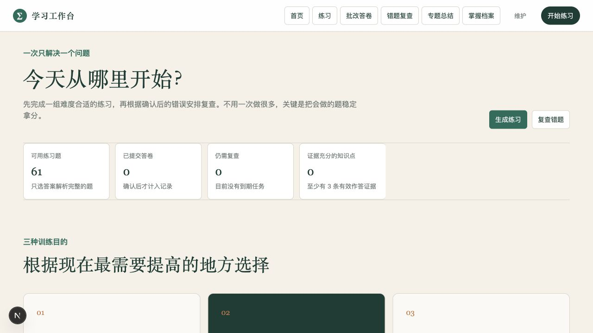
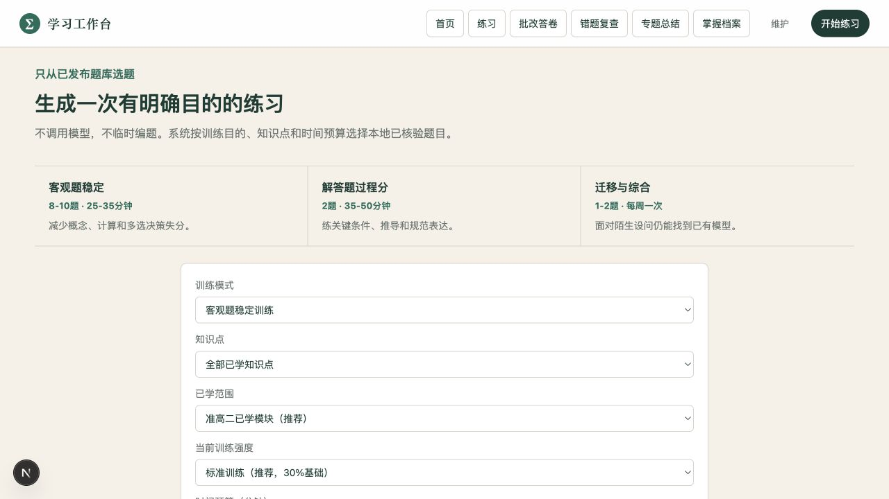
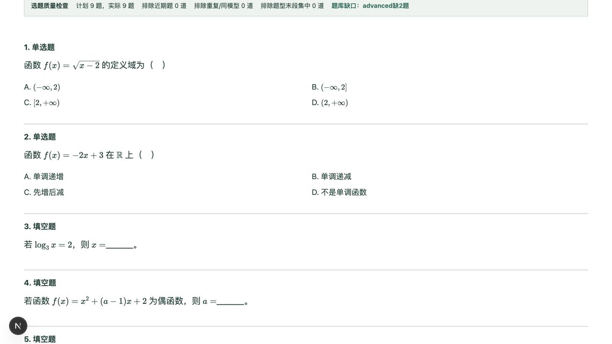
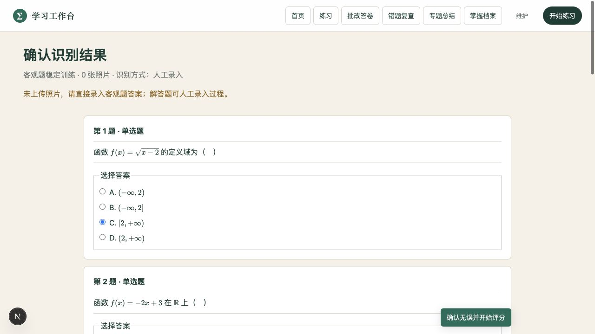
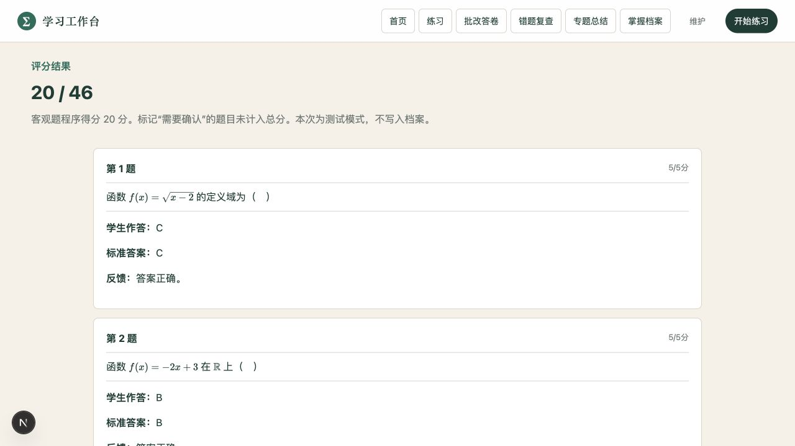

# Learning Workbench · 学习工作台

## 我的角色

- 定义“选题—纸笔作答—答案确认—评分—复查”的完整学习流程
- 决定题源审核、证据不足、人工复核和测试模式等产品边界
- Codex 加速前后端实现；流程取舍、验收标准和公开范围由我判断

做完一张卷子，知道分数以后，该练什么？

这个本地数学学习项目想把后半段接起来：按训练目的选题，纸笔作答，确认答案，留下评分依据，再安排错题复查。它从一个学习者的使用场景出发，已经有前后端和本地数据库；目前仍是本地应用。



*公开演示从 61 道自编或改写样题开始，学习记录为空。首页先问今天要练什么，不要求先浏览整个题库。*

## 一次练习怎么走

### 先选训练目的，再选题

「客观题稳定」「解答题过程」「迁移与综合」不是三个换了名字的随机按钮。组卷会考虑已学范围、难度比例、时间预算、近期做过的题，以及同模型题是否过多。



题目不够时，页面保留缺口。此次演示生成了 9 题、预计 27 分钟，同时提示提升题缺 2 道；题量凑齐了，不代表难度配额也满足。



*这是浏览器里的真实练习单，可切换答案版并按 A4 打印。公式由 KaTeX 渲染，截图没有使用真实学生信息。*

### 先确认答案，再让评分进入记录

客观题可以直接录入，不必上传照片。有照片时，识别文本仍要让人检查。没有配置视觉模型，就明确使用人工录入，不假装识别成功。



单选、多选和常见填空由本地规则判断；不支持的数学表达保留为待复核。解答题需要完整评分点和作答证据，模型给出的也只是待审核建议。



*这里填的是临时演示答案。测试模式会运行评分，但不会把它们写入掌握档案和错题复查。*

## 这次做产品时，真正需要决定的事

**练习是给学习者用的，题源审核是给维护者用的。** 日常导航只放练习、批改、复查和专题；导入、OCR 草稿、来源追溯和题目发布放到维护入口。它们共享数据，但不该共享同一份操作负担。

**题少一点，也比不可靠的题进入反馈链好。** 缺答案、缺解析、来源或题目边界有问题，都会影响后面的判断。当前组卷只使用已发布且内容完整的题；审核能力与来源核验仍需要维护者参与。

**一次答对不等于掌握。** 错题第一次安排三天后复查，连续两次复查正确才标记稳定；掌握档案在证据少于三条时显示「证据不足」。这些是当前规则，尚没有学习效果数据证明它们最优。

完整的功能、代码位置和局限见 [实现说明](docs/implementation.md)，产品流程和验证方式见 [设计记录](docs/product-decisions.md)。

## 自己跑起来

此次使用 Node.js 26 和 npm 验证。项目脚本使用原生 SQLite 和 TypeScript 类型剥离，旧版 Node 可能不支持；模型配置可以保持为空。

```sh
cp .env.example .env
npm ci
npm run db:migrate
npm run db:seed
npm run questions:foundation
npm run questions:high-one-core
npm run topics:seed
npm run dev:local
```

打开 `http://127.0.0.1:3006`。主流程使用 Next.js、React、TypeScript、Prisma 和 SQLite，数据保存在本地。公开仓库保留题源导入代码，但不携带原卷、下载题库、答卷照片或个人学习记录。

```sh
npm test
npm run lint
npm run typecheck
npm run build
```

此次整理验证了 39 项规则测试、类型与代码检查，以及合成题库的组卷→人工录入→测试评分流程。真实照片 OCR 和解答题模型评分没有作为本次验证结果；也没有在线部署、多用户或学习效果验证。

项目使用 Codex 辅助开发和整理。这里保留的是实际实现与当前边界，后续更需要做真实流程的错误分析，再调整题目配额和反馈规则。

## 许可

代码使用 MIT License。公开演示题目的来源与改写边界仍按仓库中的题源记录单独核对。
